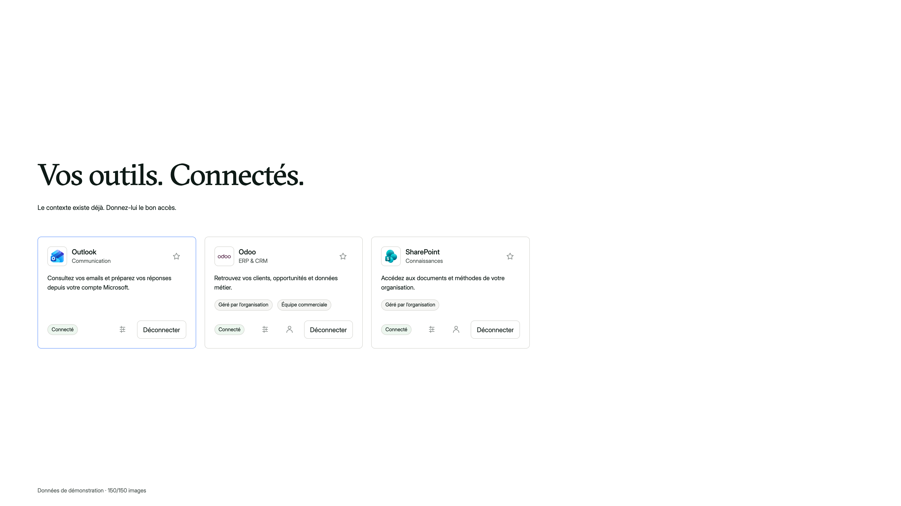
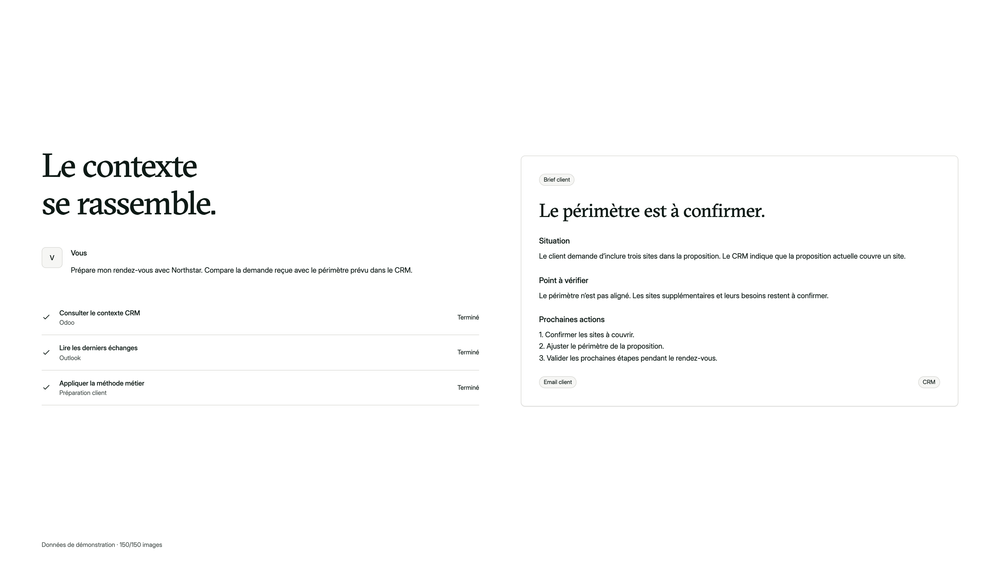
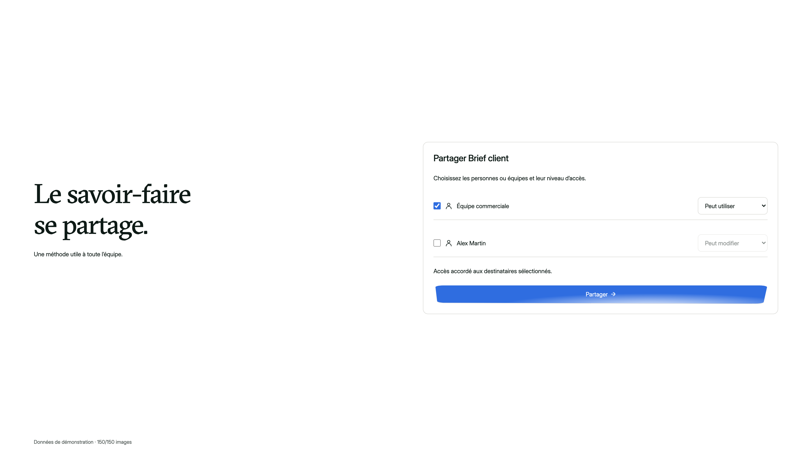

# Poses de référence 4K

Chaque PNG fait 3840×2160. `000` = avant, `060` = action, `150` = après. Le thème sombre est fourni à la pose finale. Les sources restent éditables dans le package React ; ces images sont des références compositées.

| Création | Connexion |
|---|---|
|  |  |

| Exécution | Partage |
|---|---|
|  |  |

Voir [MOTION.md](../MOTION.md) et [manifest.json](../manifest.json) pour le texte, les calques et les frames exactes.
